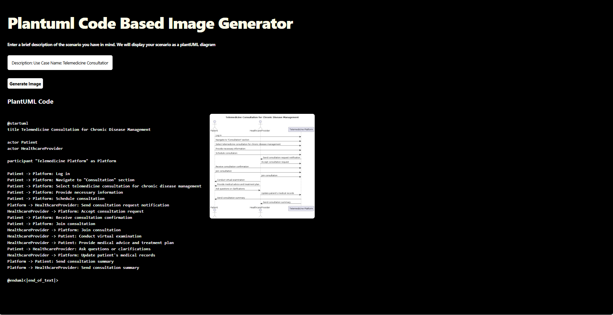

# PlantUML Generation

# Task 1: Training a Large Language Model
The Llama 3(llama-3-8b-bnb-4bit) model using Unsloth was used for training the given [Dataset](https://huggingface.co/datasets/coai/plantuml_generation). The Llama 3 model was chosen for the challenge since it is one of the latest models which was trained ~8x more data on over 15 trillion tokens. The Unsloth framework  was used for the challenge since it tackles large language model training, making it more efficient and less resource-intensive. The training was conducted on Google Colab. The trained model can be accessed [here](https://huggingface.co/RakhiNair/plantuml_generation_model)

# Task 2: Backend and Frontend Development

## Backend Development: 
The backend of the application was constructed using FastAPI. Testing was facilitated through Ngrok's public URL. It's worth noting that Ngrok generates a unique public URL each time, ensuring dynamic accessibility. 

To kickstart the application, begin by running the ipynb file:[plantuml_generator_api](https://github.com/RakhiNair/plantuml_generator/blob/main/plantuml_generator_api.ipynb). This file initializes the server and retrieves the dynamic public URL provided by Ngrok. Subsequently, this URL needs to be integrated or updated within the frontend component, particularly within the JSX file : [Image_display](https://github.com/RakhiNair/plantuml_generator/blob/main/src/components/Image_display.jsx), to fully experience the application. 

For backend development, Google Colab was utilized, given the constraints posed by my Windows operating system. Unfortunately, I encountered challenges with package installations with Unsloth(Triton package installation), particularly on Windows, which hampered the completion of development. An alternative approach could involve hosting the fine-tuned LLM (Large Language Model) on a cloud platform such as Google or AWS. However, due to financial constraints, this avenue couldn't be pursued at this time.

## Frontend Development:
The frontend of the application was crafted with React alongside Vite, a cutting-edge build tool renowned for streamlining the development and build processes of web applications. To enhance aesthetics and efficiency, Tailwind CSS was employed, a versatile and adaptable CSS framework offering a plethora of utility classes, empowering developers to create bespoke designs seamlessly integrated into their HTML structures.

The complete application is deployed on GitHub Pages and can be viewed [here.](https://rakhinair.github.io/plantuml_generator/)

# Run the Application:

To update the deployed application on GitHub Pages or interact with the application. Please follow the below steps:

1. Run the ipynb file:[plantuml_generator_api](https://github.com/RakhiNair/plantuml_generator/blob/main/plantuml_generator_api.ipynb)
2. Get the public Ngrok url.
3. Paste/modify the url provided in jsx file: [Image_display](https://github.com/RakhiNair/plantuml_generator/blob/main/src/components/Image_display.jsx) with the new URL.
4. Run Build Script :  npm run build
5. Deploy to GitHub Pages : npm run deploy

# Screenshot of the Application:

# Generated PlantUML Diagram displayed in the screenshot of the Application:

This coding challenge was an invaluable learning experience, especially as it was my first foray into both React and FastAPI. Thank you for the opportunity – I'm eager to hear your feedback and continuously improve my skills.
