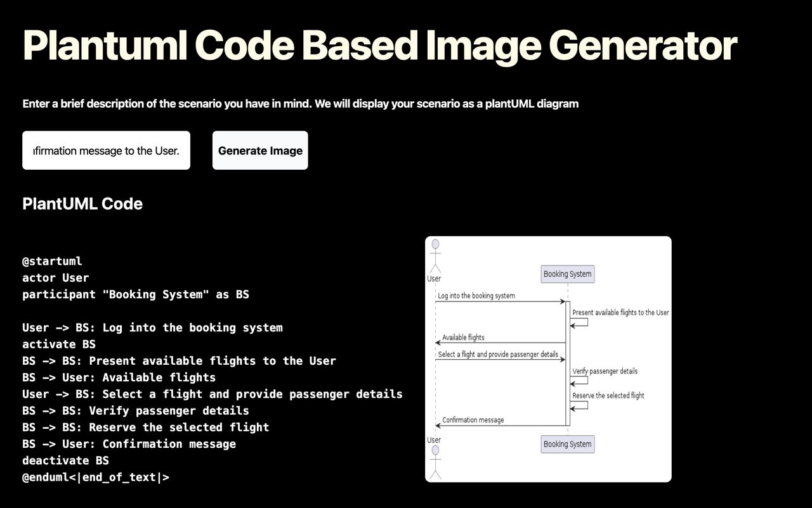

# Plantuml Generation

# Task 1: Training a Large Language Model
The llama-3-8b-bnb-4bit model using unsloth was used for training the given [Dataset](https://huggingface.co/datasets/coai/plantuml_generation). The training was conducted on Google Colab. The trained model can be accessed [here](https://huggingface.co/RakhiNair/plantuml_generation_model)

# Task 2: Backend and Frontend Development

## Backend Development: 
The backend was built using FastAPI. The application was tested using the Ngrok public URL. Each time Ngrok creates a distinct public URL. In order to start the application, first run the ipynb file:[plantuml_generator_api](https://github.com/RakhiNair/plantuml_generator/blob/main/plantuml_generator_api.ipynb). This file starts the server and generates the public URL provided by ngrok. This url should be provided in the frontend part inorder to view the complete application.

## Frontend Development:
The frontend was developed using react + vite. The styling was done using  .

The complete application is deployed [here.](https://rakhinair.github.io/plantuml_generator/)

## Screenshot:

